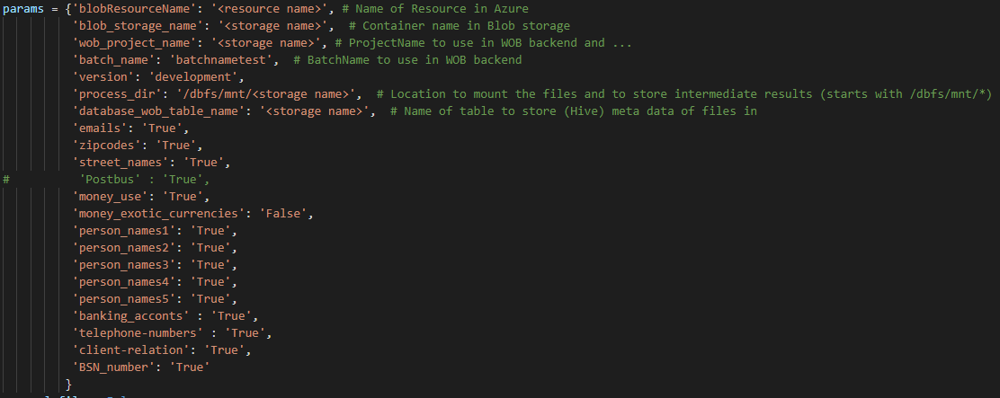
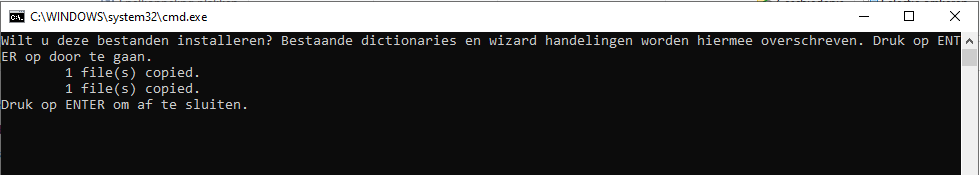
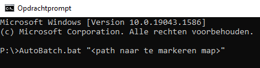
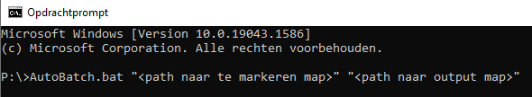

  

## Inleiding

In het kader van het WOB/WOO hebben wij algoritmes ontwikkeld om persoonsgegevens te gaan identificeren in documenten.Met behulp van de code in deze repository kunnen persoonsgegevens in documenten gemarkeerd worden in Adobe Acrobat.
Het begin punt is dat het bestandstype van de documenten moet pdf zijn. Om documenten naar pdf te converteren kan de [PDF-conversion-tool](https://github.com/Provincie-Zuid-Holland/PDF-conversion-tool) gebruikt worden. 

De volgende persoonsgegevens kunnen worden herkend:
- Email adressen
- Straatnamen met huisnummers en postcodes
- Voor‐ en achternamen
- Geldbedragen
- KvK‐nummer, IBAN, BRS‐nummer, telefoonnummers
- Persoonlijk beleidsopvattingen (indicatie van waar ze in de tekst zou kunnen staan)

Twee Databricks notebooks zijn gebruikt om verschillende stappen te verrichten:
- Notebook1_ocr_tika.py: 
	- OCR (Optical Character Recognition) kan gedaan worden om afbeeldingen over te zetten naar tekst
	- parsen is gebruikt on tekst in pdf's te herkennen en op te slaan asl .txt
- Notebook2_weglakken.py: in deze notebook worden op basis van verschillende regex persoonsgegevens herkent. Een dictionary wordt gemaakt van alle herkent gegevens en de bestanden voor het markeren van de pdf documenten in Adobe Acrobat worden ook gemaakt.

## Persoonsgegevens herkennen in Databricks
### OCR en tika parsen
Ga naar de notebook Notebook1_ocr_tika.py. Vul de juiste parameters in.

  

Run de ETL steps op de pdf documenten en check dat alle documenten goed geparsed zijn. Herhaal als nodig de OCR en dan de tika parsen.
Er wordt een nieuwe map 'tika_parsed' gemaakt in de 'process directory' (process_dir) met alle gevonden documenten als .txt bestanden.

### Gegevens herkennen en dictionary maken
In notebook Notebook2_weglakken.py wordt een dictionary met hetkent persoonsgegevens gemaakt. Ter controle is de dictionary doorgestuurd aan het wob team voordat documenten gemarkeerd worden. Het wob team geeft dan feedback (toevoegen en weghalen van gegevens) en eventueel wordt de dictionary aangepast.
Deze notebook kan meeteen worden gebruikt vanaf de notebook Notebook1_ocr_tika.py'. Om de notebook zelf te runnen moeten de parameters aangepast worden.
Als resultaat wordt er een map 'Output_ProDC' gemaakt in de 'process directory' met de benodigde bestanden (inclusief de Adobe dictionary) voor het markeren van de PDF's in Adobe Acrobat.

## PDF's markeren in Adobe Acrobat Pro DC of X Pro
### Bestanden downloaden en installeren
Installeer de dictionary en wizard handeling in je lokale adobe settings door naar de map 'Output_ProDC' te gaan en 'bestanden_installeren.bat' te runnen.

  

### Bestanden markeren
Run daarna het bestand 'AutoBatch.bat'. 'AutoBatch.bat' gaat Adobe Acrobat Pro DC aan de achterkant openen, de bestanden markeren en opslaan, en Adobe closen. Deze kan op twee manieren gedraaid worden. 
Dubbelklik op 'AutoBatch.bat' om handmatig individuele bestanden te selecteren voor markering. Gemarkeerde bestanden worden in de map met de originele bestanden opgeslagen (originele bestanden worden vervangen). 

'AutoBatch.bat' kan ook vanaf de command prompt gedraaid worden. Met deze optie kan ook een map met eventueel sub-mappen geselecteerd worden. De gemarkeerde bestanden worden dan opgeslagen in de originele mappen (originele bestanden worden vervangen).

  

Het is ook mogelijk om de gemarkeerde bestanden in een specifieke map op te slaan (deze moet wel een bestaande map zijn). Met deze optie worden alle bestanden (ook die van sub-mappen) in de dezelfde map opgeslagen.

  

## Weglakken in Adobe Acrobat Pro DC
Voor het werken met gemarkeerde bestanden in Adobe Acrobat Pro DC zie de handleiding.
